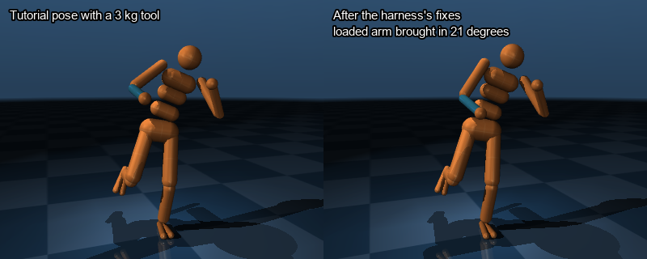
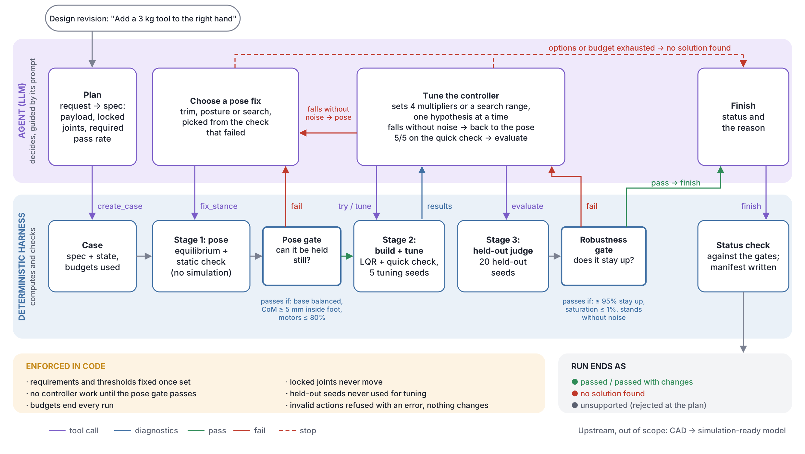
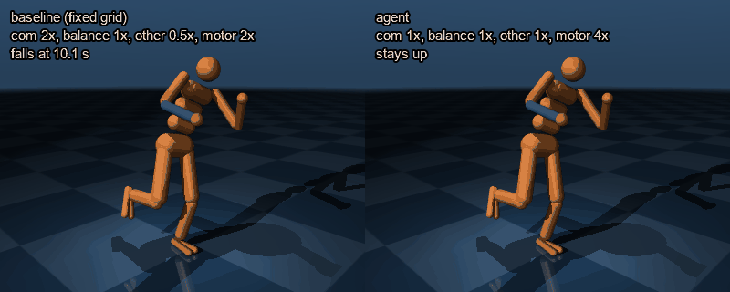
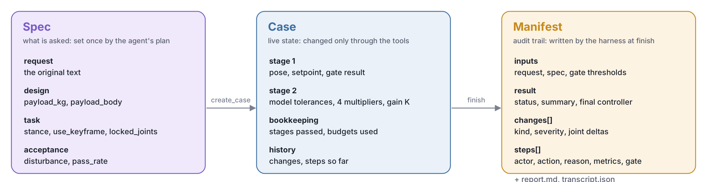

# An agent-driven harness for the MuJoCo LQR humanoid tutorial

Aurora S. Bjørlo · 8 October 2026

## 1. The tutorial

I chose the LQR tutorial from [MuJoCo](https://mujoco.org), an open-source physics engine widely used in robotics, because control is a field I know well enough to see where the manual effort really goes, rather than just automating the tutorial's commands. It balances a simulated humanoid on one leg in four steps: find a pose where it can stand still, linearize its dynamics around that pose, design a linear-quadratic regulator (LQR, an optimal feedback controller), and check that it stays up for 12 seconds while random disturbances are added to its motor commands. The disturbances come from a random *seed*: the same seed always gives the same disturbances, and a new seed gives a new, unseen test.

<p align="center"></p>

*Left: tutorial pose, 3 kg tool on the right forearm (blue). Right: re-balanced by the harness, with the loaded arm brought in about 20 degrees towards the body.*

In practice, tuning is rarely a one-off: a small change to the hardware, the payload or the requirements can invalidate the previous pose or controller, and someone has to work out what changed, recover a working solution and check it again. I think that loop, repeated on every design revision, is where automation pays off. Automating the unchanged tutorial would only need a script, so I use design changes to test whether an agent can work out which stage to revisit.

The harness takes a design request in plain language ("add a 3 kg tool to the right hand") and either returns a controller validated on unseen disturbances, or explains why it couldn't find one.

The idea the design is built around: if getting it wrong would produce a wrong or unsafe result, it is code; if it is a choice between valid actions, it is the agent's. The agent decides what to try next, deterministic tools do every calculation, and the harness owns the gates, the requirements and the audit trail.

## 2. The manual run

The tutorial works because its numbers were picked by hand for exactly this robot: the one-leg pose, the range to search for the standing height, which joints count for balance, three cost weights, and a single seed judged by watching the video. Even unchanged, it is fragile: on 20 new seeds, it stayed up 6 times.

With a 3 kg tool in the hand, none of those numbers held. Getting back to a working controller took this manual work (details in `tutorial/friction_log.md`):

1. **Retuning the controller, which didn't help.** The robot fell after 1.4 s, and five different weight changes all fell at almost the same moment. The problem wasn't the controller.
2. **Finding the real cause in the pose.** The tutorial only adjusts the robot's height until the foot carries its weight; it never checks whether the robot is tipping. With the tool, the centre of mass sat 2.6 mm outside the foot, and the ankle needed 116% of its strength just to stand still. Retuning can't fix that.
3. **Writing a check for it.** A static check answers "can this pose be held at all?" in milliseconds, without simulating: is the centre of mass over the foot, and can every motor supply the torque it needs?
4. **Fixing the pose.** A 1-degree ankle adjustment is enough up to 1 kg; for 3 kg, the loaded arm had to come in about 20 degrees towards the body. Whether that is acceptable depends on the task.
5. **Retuning for robustness.** I translated the weights into physical tolerances (how far the centre of mass and each joint may move), searched 81 combinations, and confirmed the best on fresh seeds: a quick 5-seed check picked controllers that passed only 7 of 20.

Starting from the ground up, with no hand-made pose, a search found a one-leg stance in under a second, and tuning took it to 20/20. With 6 kg, the search settled on a pose needing 92% of the ankle's strength (limit 80%), although a workable pose exists; the static check rejected it before any controller work.

Most of this was diagnosis: reading the numbers, guessing at the cause, and deciding which step to go back to. That is the part I gave the agent; the calculations and checks became code.

## 3. The design: what the agent decides and what the harness enforces



A run moves through three stages and two gates the agent can't change:

1. **Plan.** The agent turns the request into a spec: the payload, any joints that must not move, and the requirements (disturbance level and pass rate). From then on, the spec is fixed.
2. **Stage 1: the pose.** The harness computes the equilibrium and the static check. The pose gate asks whether the pose can be held still at all, without simulating: the base balanced, the centre of mass at least 5 mm inside the foot, and no motor above 80% of its strength, which leaves headroom for disturbances. If it fails, the agent picks a fix from the check that failed: a trim if only the base is unbalanced, a posture change if the centre of mass or a motor fails, a stance search if there is no starting pose. The harness applies it, moving only the joints the task allows. Every change is raised by size (info under 5 degrees, warning to 25, major beyond); in a real product, a major change would need human approval.
3. **Stage 2: build and tune.** The agent chooses four multipliers on tolerances derived from the model (1 is the physical default), or a range for the harness to search. The harness builds the LQR controller and runs a quick check on five tuning seeds, returning diagnostics: which motors saturate and when, fall times and drift. The agent states a hypothesis and changes one or two multipliers at a time; falling even without noise points back to the pose. The tools define what each multiplier does to the LQR cost: more motor effort lets the controller use more of the motors' range, never different motors.
4. **Stage 3: the held-out judge.** The harness runs 20 held-out seeds, never used while tuning. Each judgement gets a fresh block (26-45, then 46-65), so once the agent has seen a block's results, that block is never used to judge again. The robustness gate checks the pass rate, motor saturation, and that the robot stands without noise. If it fails, the agent reads the diagnostics the same way and retunes or goes back to the pose.
5. **Finish.** After a pass, or when nothing allowed works or the budget runs out, the agent finishes with a status and a reason. The harness checks the status against the gates (no "passed" without the robustness gate), writes the manifest, and the run ends as passed, passed with changes, no solution found, or unsupported.

The rules for reading failures are guidance in the prompt, not code; the gates are code. So the agent's freedom is in the choices: how to read the request, which fix to try, what a failure means, and when to stop. Everything that decides correctness is code: the physics, the gates, the requirements, the seed split (1-5 to try, 6-25 to choose, a fresh block of 20 for each judgement) and the budgets that end every run. Every action needs a stated reason, which goes into the audit trail. The thresholds are prototype values from my manual runs; in production, they would come from engineering requirements.

## 4. Where the agent adds value, and where it doesn't

An optimizer is very good at finding numbers once the problem is framed: which parameters, what bounds, what objective. Getting the framing right was most of my manual run: seeing that the problem was the pose, not the controller, and reducing dozens of weights to four physical multipliers. So I see the agent as the work around an optimizer: it frames and reframes, the optimizer searches inside the frame, and the gates judge the result.

That is where the agent buys flexibility over a fixed script: turning a plain-language request into constraints, reading a failure to choose which stage to revisit, and following the evidence past a predefined search range, without a branch written for each case. Where the problem fits the script, a script is enough. With expensive simulations (CFD or FEA, hours each), a targeted search matters most.

The baseline is a rule-based script on the same tools: fixed order, the default 81-point grid, and the request already parsed for it. It isn't the best possible optimizer, but roughly the workflow I would otherwise have written.

| Case | What needs to change | Baseline | Agent |
|---|---|---|---|
| 3 kg in the hand | The pose: the ankle can't hold it | Passed, 570 simulations | Passed, 27 simulations |
| 1 kg, 3.5 times the disturbance | The controller: more motor effort | No solution found: its pick passed 20/20 when chosen, 17/20 when judged | Passed in 2 of 3 runs: 20/20 on held-out seeds with 4x motor effort, outside the baseline's grid |
| 5 kg, right arm locked in place | Nothing allowed works: the right answer is to stop | No solution found, reporting the failed check | No solution found, naming the cause: the locked shoulder needs 107% of its strength, and no allowed fix reduced it |

<p align="center"></p>

*3.5x case, same pose and seed: the baseline falls at 10.1 s, the agent's controller stays up.*

A passing run on the 3.5x case, condensed from its manifest:

```
check_feasibility         FAIL  root torque 6.6 Nm; left ankle needs 83% of its range
fix_stance(trim, posture) PASS  ankle at 80%, CoM 6 mm inside the foot (2 deg change, info)
try_controller(default)         0/5 stay up; left ankle saturates from 0.2 s
  "...suggests control effort is too cheap; tighten motor tolerance (motor=0.5)"
try_controller(motor 0.5)       0/5, falls sooner, more saturation
  "Tightening motor cost worsened saturation and falls; try the opposite direction"
try_controller(motor 2)         1/5 stay up
try_controller(motor 4)         5/5 stay up, no saturation
tune(motor 3, 4, 5)             best: motor 4, 20/20 on choose seeds
evaluate                  PASS  20/20 on held-out seeds 26-45 -> passed_with_changes
```

The run that didn't pass tightened the balance joints instead: 20/20 on the selection seeds, but 18/20 on two held-out blocks (26-45, then 46-65), so it stopped with no solution found. The seed split caught exactly the overfitting it is there for.

The physics here is control, but the split isn't specific to MuJoCo. In CFD the stages would be geometry and mesh, solver setup, and convergence and physical checks, with the same rule: code owns the numbers, the agent chooses which stage to revisit, and the gates decide what passes.

## 5. Data model

<p align="center"></p>

The manifest is the provenance record: the request, the parsed spec, the gate thresholds, every action (who, why, parameters, metrics, gate result, seeds), every design change with its severity, and the final controller.

## 6. Limitations and next steps

- **"No solution found" is not a proof**: the searches are local and budgeted. Next, I would separate physically infeasible, search exhausted and numerical failure.
- **The agent parses the requirements**; only a person reading the report would catch a misreading.
- **What the spike showed is missing.** Stages take no targets (the agent can't ask the pose stage for more motor headroom), and tries aren't compared with the last. Both would make the search more reliable than 2 of 3. Scope: one model, left leg, holding a pose.
